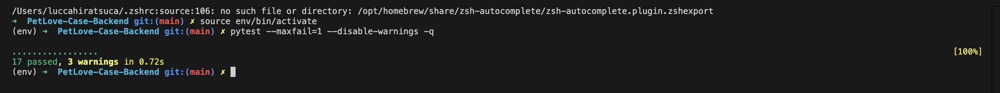
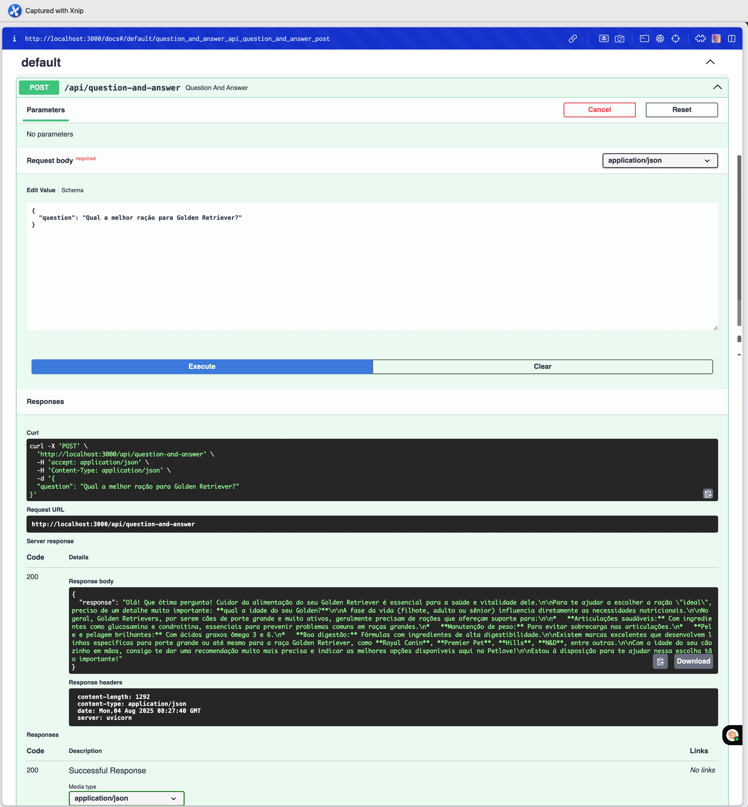
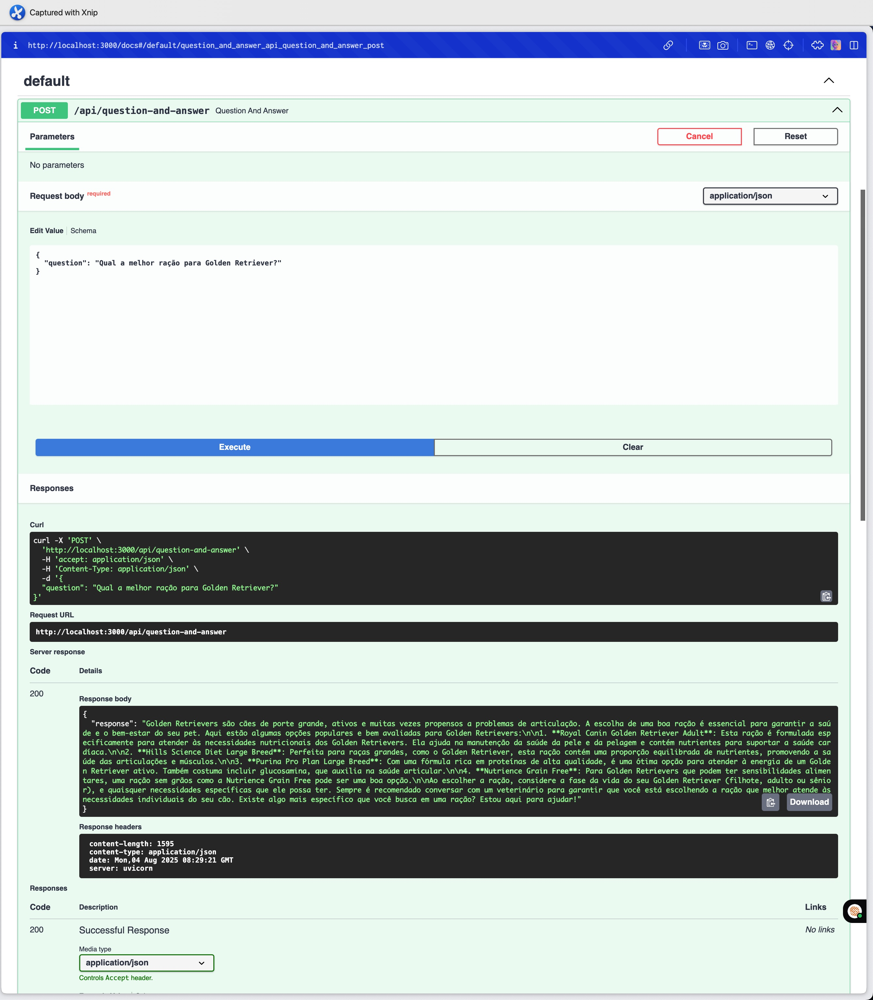
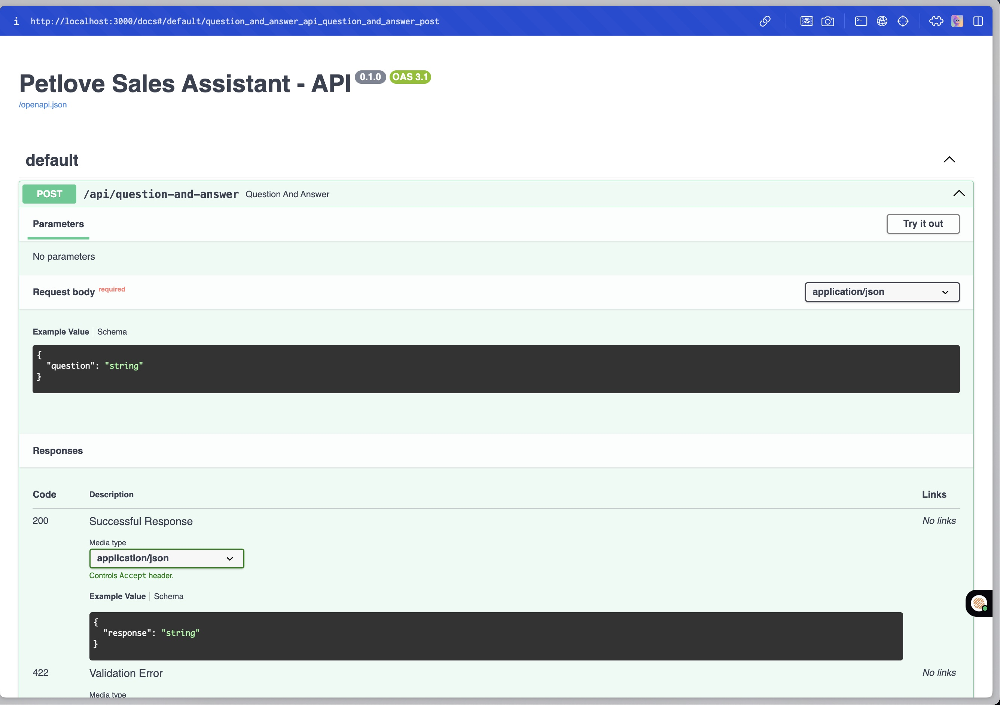
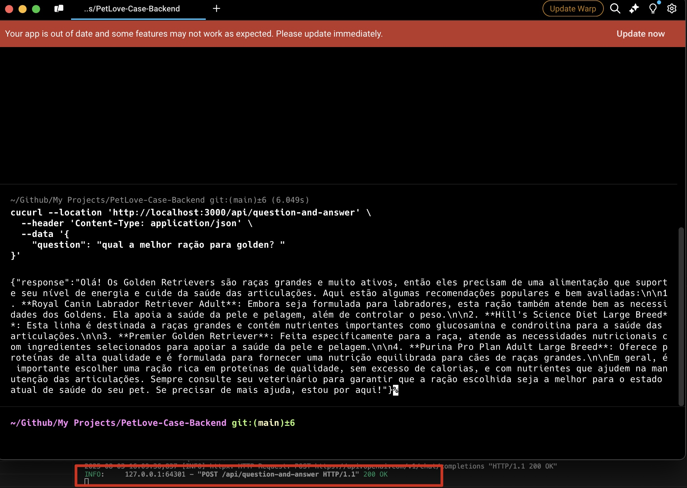

# PetLove-Case-Backend

## Overview

Esse é um microserviço baseado em FastAPI que integra modelos de IA (OpenAI, Gemini etc.) para fornecer um assistente de vendas conversacional no e‑commerce Petlove. Ele adota uma arquitetura limpa, implementações de cliente de IA orientadas a interface, injeção de dependências e persona configurável para prompts.

## Features

* **Múltiplos Provedores de IA**: Alternância fácil entre OpenAI e Google Gemini via configuração.
* **Prompts com Persona**: Utiliza persona de assistente de vendas para respostas profissionais e focadas no cliente.
* **Arquitetura Limpa**: Separação de responsabilidades em config, logging, models, clients, services, rotas e testes.
* **Swagger UI**: Documentação interativa da API com FastAPI (http://localhost:3000/docs).
* **Testes Unitários**: Base inicial de testes para clientes de IA e endpoints da API.

## Arquitetura & Estrutura de Pastas

```
petlove-case-backend/
├── app/
│   ├── __init__.py
│   ├── main.py              # Ponto de entrada da aplicação
│   ├── config.py            # Configurações via Pydantic BaseSettings
│   ├── core/
│   │   └── logging.py       # Setup de logging centralizado
│   ├── models/
│   │   ├── request.py       # Schema de requisição (Pydantic)
│   │   └── response.py      # Schema de resposta (Pydantic)
│   ├── api/
│   │   ├── routes.py        # Definição de rotas FastAPI
│   │   └── dependencies.py  # Injeção de dependências para AIClient
│   ├── services/
│   │   ├── ai_client.py     # Protocol (interface) AIClient
│   │   └── prompt_builder.py# Builder de prompts com persona
│   └── clients/
│       ├── openai_client.py # Implementação OpenAI
│       └── gemini_client.py # Implementação Google Gemini
│
├── assets/               # Recursos estáticos (imagens, etc.)
│
├── tests/
│   ├── test_dependencies.py  # Testes de injeção de dependências
│   ├── test_endpoints.py       # Testes de endpoints da API
│   ├── test_models.py          # Testes de modelos Pydantic
│   └── test_prompt_builder.py # Testes do builder de prompts
│
├── .gitignore               # Arquivos a serem ignorados pelo Git
├── conftest.py              # Configuração do pytest
├── .env.example             # Exemplo de variáveis de ambiente
├── requirements.txt         # Dependências Python
└── README.md                # Esta documentação
```

## Pré-requisitos

* Python 3.11 ou superior
* pip (gerenciador de pacotes)

## Instalação

1. **Clone o repositório**

   ```bash
   git clone https://github.com/LuccaHiratsuca/PetLove-Case-Backend
   ```

2. **Crie e ative um ambiente virtual**

   ```bash
   python -m venv env
   source env/bin/activate  # Linux/macOS
   env\Scripts\activate   # Windows
   ```

3. **Instale as dependências**

   ```bash
   pip install -r requirements.txt
   ```

## Configuração

1. Copie `.env.example` para `.env` e preencha suas chaves:

   ```ini
   OPENAI_API_KEY=your_openai_key
   GEMINI_API_KEY=your_gemini_key
   AI_PROVIDER=openai  # ou gemini
   ```

2. Variáveis de ambiente:

   * `OPENAI_API_KEY`: chave da OpenAI
   * `GEMINI_API_KEY`: chave da Google Gemini
   * `AI_PROVIDER`: provedor padrão (`openai` ou `gemini`)

Não esqueça de criar um arquivo `.env` com suas variáveis de ambiente **corretas!**.

## Executando a Aplicação

Estando no diretório raiz do projeto, execute:

```bash
uvicorn app.main:app --reload --host 0.0.0.0 --port 3000
```

## Swagger UI

Caso queira acessar a documentação da API, você pode usar o Swagger UI:
Acesse [http://localhost:3000/docs](http://localhost:3000/docs)

## Uso da API

### POST /api/question-and-answer

Envia uma pergunta do usuário e recebe uma resposta focada em vendas.

* **URL**: `/api/question-and-answer`
* **Método**: `POST`
* **Content-Type**: `application/json`

#### Request Body

```json
{
  "question": "Qual a melhor ração para Golden Retriever?"
}
```

#### Response Body

```json
{
  "response": "Escolher a melhor ração para um Golden Retriever envolve considerar ..."
}
```

## Alternando o Provedor de IA

Para alternar qual LLM utilizar, basta alterar a variável `AI_PROVIDER` no arquivo `.env` para `openai` ou `gemini`. A aplicação irá automaticamente utilizar o cliente correspondente.

## Testes

Com o intuito de garantir a qualidade do código, foram implementados testes unitários utilizando `pytest`. Eles cobrem a injeção de dependências, modelos Pydantic e endpoints da API.

Para executar os testes, certifique-se de que o ambiente virtual está ativo e execute, na raiz do projeto:

```bash
pytest --maxfail=1 --disable-warnings -q
```

## Demonstração de Uso

A seguir estão algumas capturas de tela exemplificando o uso da API em diferentes cenários:

**Testes funcionando (pytest)**


**Resposta 200 OK - Gemini**


**Resposta 200 OK - OpenAI**


**Swagger UI**


**Resposta 200 OK - Usando Curl**


- Curl Utilizado:

   ```bash
      curl --location 'http://localhost:3000/api/question-and-answer' \
      --header 'Content-Type: application/json' \
      --data '{
         "question": "qual a melhor ração para golden? "
      }'
   ```